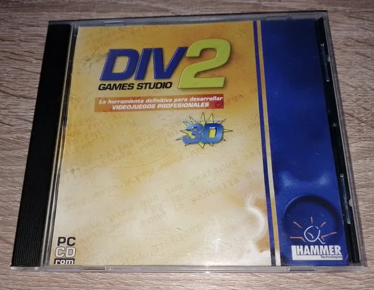
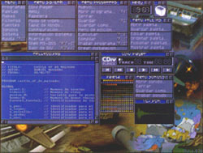

I started programming almost by accident at the age of 12.
In one of the local "buy by catalog" magazines, I found what I thought it was a collection of video games.
It looked like a great plan to spend the whole summer playing, and despite being my entire savings for the month it was relatively cheap.
That "collection" turned out to be what nowadays we call a "game engine" called Div2 Games studio.

With all the money for the summer gone, I had no option but to "play" with the demo games.
Quickly the idea of "cheating" by modifying the source code of the games came to me. I just started with simple modifications to the games, like increasing the nuer of lives, then the damage of my bullets, etc.
From time to time I made mistakes that had unexpected but fun consequences, turning the process of "experimenting" funnier than playing the game itself.
Such modifications didn't require too much reading or understanding of the code, but I eventually broke some of the games. That forced me to dive deeper into the code, having to understand in order to fix it if I want to play the game again.

After weeks of messing with the demo games, I was confident enough to start doing my own experiments.
However, the "environment" came with a very good manual in my own language. This was very important because this was before the internet was mainstream and full of information, and my English level was quite poor.
With the help of the manual and the great set of tools that came in the studio, I started by just creating what I can only call "fun experiments"
Let me empathize how good the selection of included tools was. It had an explosion generator, sprites generator, assets manager, code editor with direct access to the docs... I never experienced such a "integrated" experience since then.

Let me say that video game programming was (still is) hard, like very hard. Specially if you have to implement physics, interaction systems, etc. The difficulty though had some positive consequences on me:
I had to review my notes from the school about physics, mathematics, etc. because I wanted to be able to describe parabolic shots, simulate falls, etc.

The huge amount of edge cases that video game programming involves also shaped my brain to think about problem solving, preventing issues, logging them, etc, which has been quite important on my career.
