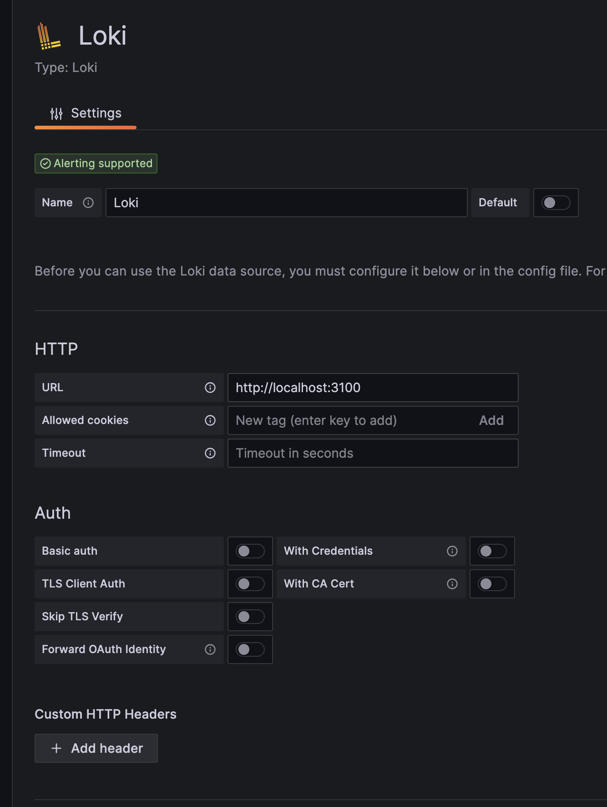
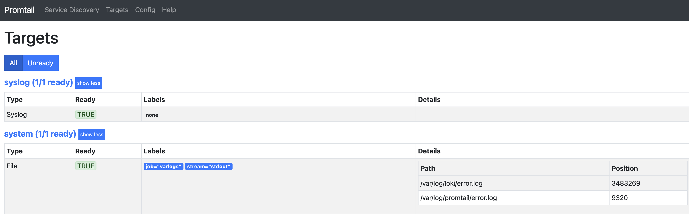

Today I wanted to get a better monitoring on some of my own apps that I am self-hosting.
My homelab is small and humble (just 3 mini-pc nodes) and honestly under utilised.
It runs on Proxmox 7, which and I am too scared of upgrading it to Proxmox 8.
I don' like having VMs, I prefer to use linux containers (LXC) because the are lightweight and also provide better control from the Proxmox UI: you see the resource usage, you can easily scale it up, etc without any special configuration.

Recently I started hosting some of my own applications (mostly node.js apps) in this homelab and it was starting to be a bit inconvenient to have to `ssh` into each LXC, cd into the right directory, and run `docker compose logs -f server-name` or whatever command to look at the right logs on each server.

What I needed was a way to collect logs and see  them in a central place without having to navigate to each node.
I previously used Graylog, but I didn't liked for my use case. It is too heavy and too hard to configure.
Grafana has a solution to collect logs composed of Loki and optionally Promtail.
Let me summarize what each one is for very quick, because it was not initially clear to me:

>[!info]
>
>- **Loki**: it is a log aggregation server. It is usually referred as "prometheus for logs", but unlike prometheus, it is push based (prometheus is pull by the way). Also, it is just a server to collect logs, unlike graylog, which also has an UI to visualize it.
>- **Promtail**: is an agent that collects logs on its host, and sends them to some remote log collector like Loki. It is very similar to logstash, logspout and friends

Most guides about deploying this stack just use docker compose and start an entire stack of `Grafana + Promtail + Loki + Prometheus` in the same server.
However, as I mentioned before, I don't use VMs and I didn't want to use docker inside LXC for this task (but I do in other cases).

Then, I thought about starting a new LXC container just for Loki... but guess what? My go-to tool for simplify this task [proxmox VE helper-scripts](https://tteck.github.io/Proxmox/) recently dropped support for Proxmox 7... so creating a new LXC for this task was out of my radar for now.
> Maybe it's time to give that old Grafana LXC some use I thought.

I took a look at it... a small and humble LXC container running just a Grafana UI pulling data from nowhere... (yeah, almost all my sources are dead by now 😅).
Both Loki and Promtail are single file binaries, which is very convenient for just deploying them on existing servers... or that is what I thought.
Firs thing, log into the LXC and see what linux it is... because I don't remember what we were dealing with...

```bash
cat /etc/os-release
NAME="Alpine Linux"
ID=alpine
VERSION_ID=3.19_alpha20230901
PRETTY_NAME="Alpine Linux edge"
```

Ah, ok, alpine... What package manager does this thing have?

```bash
apt
-ash: apt: not found
apt-get
-ash: apt-get: not found
dnf
-ash: dnf: not found
apk
apk-tools 2.14.0, compiled for x86_64.
```

Ah, ok, apk...
A quick search for Loki revealed a bit outdated versions... so firs a good old `apk update` and then another search:

```bash
apk search loki
loki-3.3.0-r0
loki-canary-3.3.0-r0
loki-logcli-3.3.0-r0
loki-openrc-3.3.0-r0
loki-promtail-3.3.0-r0
loki-promtail-openrc-3.3.0-r0
```

I have to admit that I was not sure at what I was looking at exactly... does loki-promtail include both services? do I need to install just loki? Well, I give it a try and installed loki-promtail....
That added a single command called `promtail` and no command called `loki`... so... maybe I need to install loki separately? Yes, that was it.

How do I configure this things? Not sure from where, but suddenly I felt inspired and thought... maybe the apk thing creates service definitions? let's try `cat /etc/<tab>...<tab>..<tab>..`
And I got this:

```bash
cat /etc/init.d/loki-promtail
#!/sbin/openrc-run

output_log="${output_log:-/dev/null}"
error_log="${error_log:-/var/log/promtail/error.log}"
configfile="${PROMTAIL_CONF:-/etc/loki/promtail-local-config.yaml}"

name="${name:-Promtail}"
command="/usr/bin/promtail"
command_args="-config.file=${configfile}
 ${PROMTAIL_OPTS}"
command_user="${command_user:-root:root}"
command_background=yes
make_pidfile=yes
pidfile="/run/${RC_SVCNAME}.pid"
start_stop_daemon_args="${SSD_OPTS}
 -1 ${output_log} -2 ${error_log}"

depend() {
 need net
}

start_pre() {
 checkpath -d -m 0750 -o "${command_user}" "/var/log/promtail"
}
```

Ah, ok, a very simple to understand script which gave me a lot of information:

- config is at `/etc/loki/promtail-local-config.yaml`
- error logs will go to `/var/log/promtail/error.log`
- normal logs go nowhere 😂

Thankfully alpine has quite intuitive commands, and a simple `service loki-promtail start`
Started the service. Cool, isn't it?
Let's do the same for Loki...
Sadly, the Loki experience was not that straightforward....
`service loki start` said that it started the server, but every time you check the server status it was crashed, without logs or anything.
A quick look at the init.d script revealed a not so polished config:

```bash
#!/sbin/openrc-run

configfile="${LOKI_CONF:-/etc/loki/loki-local-config.yaml}"

command=/usr/bin/loki
command_args="-config.file=${configfile}
 ${LOKI_OPTS}"
command_background=yes
command_user=loki:grafana
make_pidfile=yes
pidfile=/var/run/loki.pid
```

Ok, same config file but no logs, no start_pre... pretty barebones...
Setting up the same `output_log` and `error_log` variables and copy pasting the `start_stop_daemon_args` thing from Promtail `init.d` script gave me at least some logs...
Which revealed a problem with file permissions... first with the config file, and then with the default Loki config pointing to `/tmp/loki`... nothing `chown + chmod` can't fix...

```bash
chown -R loki:grafana /tmp/loki/
chmod 755 /etc/loki/loki-local-config.yaml
```

Now try a `service loki restart`... and after a couple more tries, I got a service up and running!
Ok, try to connect it to Grafana... just go to sources > add source

Thins are so simple when running in the same server 😂
However Grafana gave me a weird error that I didn't read at first... It was saying that it was able to connect to Loki, but that it has no metrics... And that deserves a big red banner?
I checked Promtail UI and it said that the only configured logs were... not ready
Why? again, permissions. Promtail user had no rights to read from the /var/logs folder... Ok I guess... another `chmod` quick fix
And finally, Promtail said that logs targets were ready

Loki died a couple more times (had to restart it some more)
And then, everything started working...
OK!

Maybe next I will write about how I added the `loki driver` to docker, so my docker compose files can send logs directly to Loki without any agent... but I think this is enough for today.
