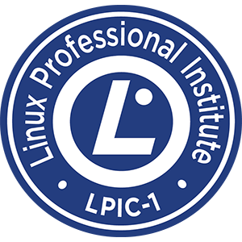
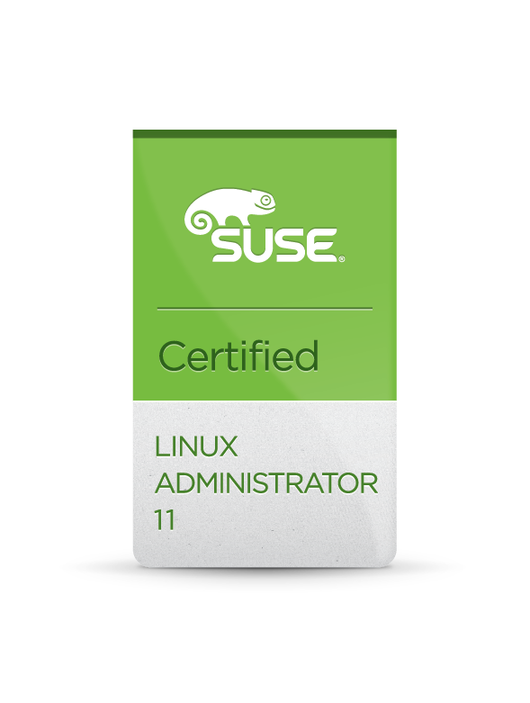

## PERSONAL STATEMENT

Throughout my career, I've learned that each day brings new challenges and opportunities. Being adaptable and versatile has been crucial to my success. I am a strong advocate for open-source, and many of my projects has open licenses. I never settle for the status quo — if I see an opportunity for improvement, I take it.

## BADGES

## CERTIFICATES & MEMBERSHIPS

- 2015 Suse Certified Linux administrator 11
- 2015 LPIC 101 Linux professional institute certified
- 2015 Development of cloud services with Node.js and express at Miriada X
- 2014 HTML5 WebApps development incl. mobile and FirefoxOs at Miriada X
- 2010 Design and network security configuration CISCO + Microsoft (1100h)
- CCNA

## EMPLOYMENT

### Feb 2024 - Apr 2025 - Fullstack engineer at Rhino.fi

**Tech Stack**: MongoDB, FP-TS, Effect-ts, Nix

At Rhino.fi, a leading **Web3 crypto bridge**, I contributed to the **Bridge and Infrastructure team**, focusing on the development and maintenance of its the bridge core functionalities.
I quickly became productive by leveraging my expertise in **Effect-TS** and I actively mentored team members through the intricacies of the framework.
My contributions included building an IP blacklisting/whitelisting mechanism.
During this role, I significantly deepened my knowledge of **Nix**.
The architecture was event-based and deployed on **Google Cloud Platform (GCP)**.

---

### Nov 2023 - Nov 2024 - Lead dev engineer at Dharma

**Tech Stack**: Typescript, Svelte, FP-TS, DynamoDB

I lead the creation of the in-house booking engine and inventory system.
I owned the entire process, from understanding requirements and helping product to collect them, to plan the required tasks and assign them to the available developers, myself included.
It was a challenging project because we were on a tight deadline, and we were also aiming at replacing an already existing solution that we were using for this purpose.
Carefully planning and specially prioritizing the most important parts was key to the success of the project.

### Sep 2022 - Nov 2023 - Freelancer at Tella

**Tech Stack**: ReasonML, React, Rust, AWS

Tella is an innovative screen recording platform with a web based editor that requires no installation at all.
As it was a very little startup, I did anything the company needed.
I took ownership of the automatic subtitles generation, displaying and edition end to end.
The frontend was built with react and ReasonML, which is a type safe functional programming language that I learned while working there.
I also had to write some little services in Rust, which I learned along the way.

### February 2020 – September 2022 Pento

**Tech Stack**: Typescript, React, Go

Pento is the first one click payroll solution. We are demonstrating that managing your employees salaries doesn't need to be hard, expensive or tedious.
Payroll is a traditionally obscure process that takes out ressources from companies that may limit their success.
Thanks to Pento handling payrolls isn't harder than using other modern tools like google docs.

---

### January 2019 - January 2020 – Aula

**Tech Stack**: Javascript, React, Redux, AWS (specially lambdas)

Aula is a social learning platform focused on make it easy for all educators to engage all students.
As a full-stack engineer my role is to make sure that the platform we built is not only technically correct and
reliable (99.9%), but that also meets the requirement of helping people reach each other. It is an humans first platform.

### June 2016 – Jan 2019 – Case on it

**Tech Stack**: NodeJS, MongoDB, Docker

On Case we use stunning cutting edge technologies as MongoDB and NodeJS to deliver the best services to our customers. We are always open to innovation and we are not afraid of doing things that no one did before, for example, we started using MongoDB even before it reached it's version 1.0

### April 2016 – June 2016 Level 3 software support – Gemalto

Apart from support task we also develop some minor enhancements to the products and generate production builds. Our solutions were developed in `C#` and Java EE.

### 2014 June – April 2016 - Support Specialist L.2 – Netsize (a Gemalto company)

One of the biggest messaging and mobile services providers.

- Support of messaging flows and incidents investigation.
- Infrastructure support on Red-Hat environment.
- Audit and management of core alarms.
- Creation of service documentation.

#### Key achievements

- Several bash scripts for incident analysis.
- I’m leading a project for document, audit and improve the scripts of the whole platform.

### 2013 March – 2014 June System Administrator Specialist – Roche

Mainly focused on maintenance and expansion of Roche’s computers infrastructure. This includes servers, services and users.

- Windows and Linux servers installations and decommissions
- Users and groups management
- Infrastructure and service monitoring
- Created a collection of scripts for repetitive tasks. All accessible through a centralized user interface.

### 2011 Dec – 2013 March - Network Operation Center – Telefónica Global Solutions

As the first level of customer support I took take care of Telefonica’s global network, with focus on being proactive NOC rather than reactive.

- Monitoring international internet links.
- Technicians management of for in-place reparations.
- Routing issues – analyzing and solving most of it

### 2010 - 2011 Several IT positions

- Day to day user issues: slow machines, lost files, incompatible hardware
- Install network drives and printers.
- Hard-Disk clone / restoration over SSH / whole disk encryption
- Backup and restoration of User data.

## Professional Strengths

- Strong emphasis on clear and friendly communication
- Passionate about sharing knowledge and mentoring
- Experienced in managing projects successfully as a lead developer
- Deep interest in Domain Driven Design
- Autonomous self learner committed to continuous personal and professional development

---

## Technical Expertise

- Frontend: **React**, Svelte, Astro, SolidJS, Leaflet
- Backend: Next.js, Supabase, Bun/Deno/Node, **AWS**, Cloudflare
- Programming Languages: **TypeScript**, Rust, OCaml
- Scripting Languages: Python, Bash, Lua, Google Apps Script
- Databases: **PostgreSQL**, **DynamoDB**, CouchDB, Redis, MongoDB
- Version Control: **Git**
- Linux Management: NFS, CRON, file/user permissions

## EDUCATION

- I.E.S. Juan de la Cierva. Madrid - Technician in Computer Systems Administration (High-Grade)
